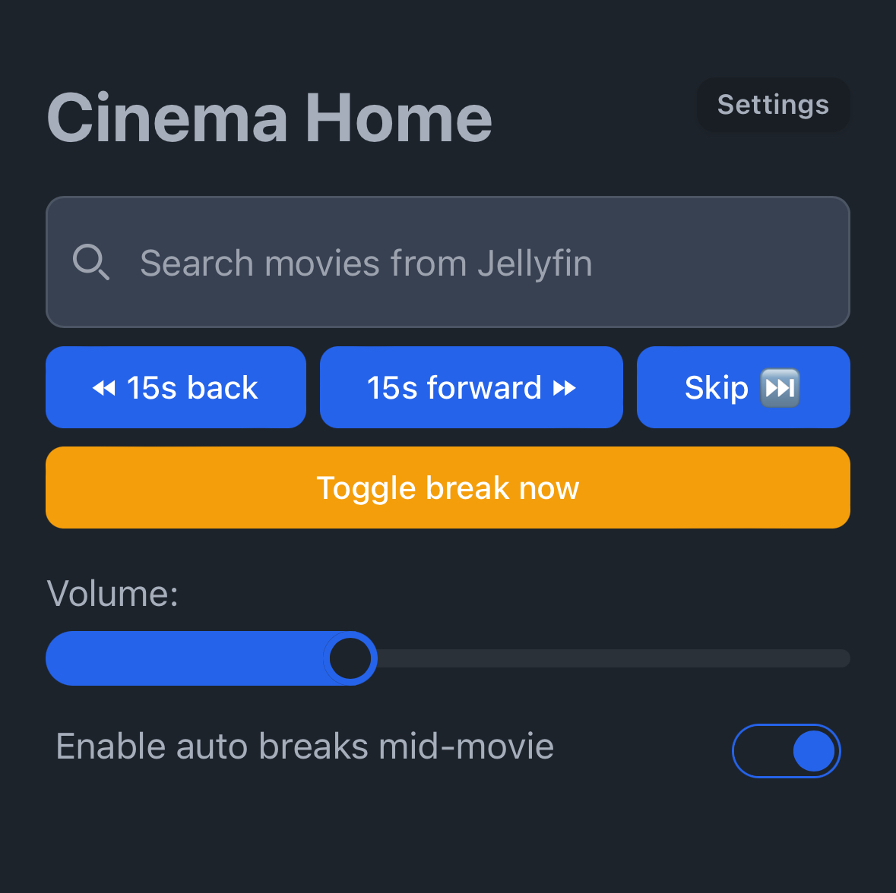

# Cinema Home
#### Bring the cinema experience to your Home Theater

With Cinema Home you can create a seamless cinema experience at home.

- Search from all your Jellyfin movies
- Create your own sequence with intros, trailers, commercials and outro's
- Control the movie from the Web-UI
- Automatically or manually start intermissions
- Will rewind 30 seconds after an intermission
- Adjust lightning at specific moments automatically with the Home Assistant integration

## Get started
1. Download the Cinema Home app for your platform (see releases)
2. Create a folder for your settings (you can use the example folder)
3. Start the app
4. Follow the instruction on screen
5. Enjoy!

 
 

> You can exit Cinema Home by holding `ESC` for 5 seconds\
> Open DevTools by pressing `i`

> v1.0.0